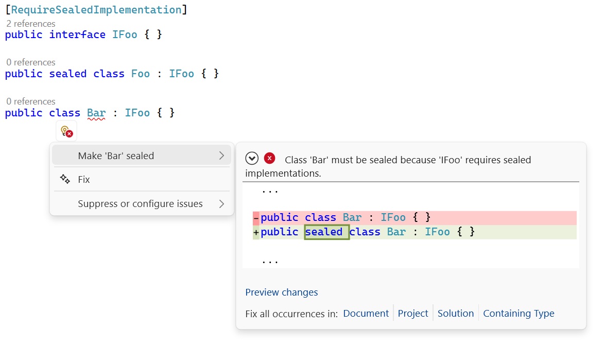

# Sealed Implementation .NET
Add an attribute to force interfaces implementation to be sealed

## Objectives

Sometimes, framework developpers wants to seal all implementations.
This tool can force users to seal their classes.

Force sealed implementations can force your framework users to use
composition over inheritance. It will mechanically reduce over-usage
of inheritance, increase locality of behaviour, therefore reduce
the complexity.

This is an example of what happens when users won't follow
your recommandations.



## Installation

To use this feature, you must first install the `vsix` plugin.
Then you will add an attribute class with this following name :
`RequireSealedImplementationAttribute`.
This class is what we call a marker class,
except this marker class is used before the compilation.

Here is the recommanded class to add to you project.

```cs
/// <summary>
/// Indicates that implementations of the annotated interface must be declared as <c>sealed</c>.
/// </summary>
/// <remarks>
/// Intended for use with a code analyzer that enforces this rule at compile time.
/// </remarks>
/// <example>
/// <code>
/// [RequireSealedImplementation]
/// public interface IService {}
///
/// public sealed class MyService : IService {}
/// </code>
/// </example>
[AttributeUsage(AttributeTargets.Interface)]
public sealed class RequireSealedImplementationAttribute : Attribute;
```

## Example

To use this feature, find the interface feature that you want to
force seal. In this example, I will work with `IPluginServiceLocator`.

Every instances of `IPluginServiceLocator` should be a final type.
No classes should be able to modify what your plugin will add to
the main application except your implementation.

Here is the example of the `IPluginServiceLocator` :

```cs
/// <summary>
/// Configure dependency injection to add features.
/// </summary>
[RequireSealedImplementation]
public interface IPluginServiceLocator
{
    /// <summary>
    /// Adds features to the main dependency injection system.
    /// </summary>
    /// <param name="services"></param>
    /// <returns>A configured service collection.</returns>
    public IServiceCollection Initialize(IServiceCollection services);
}
```

Next step is to create some user features like "MyPlugin".
The injection service shoud not be overridable. The creator
of `IPluginServiceLocator` knew it before the user wanted to create
it's own plugin. So it has to be `sealed`.

Here is an example of an implementation of `IPluginServiceLocator`.
For the example, I made this class heritable on purpose.

```cs
public class MyMachineServiceInjector : IPluginServiceLocator
{
    public IServiceCollection Initialize(IServiceCollection services)
    {
        services.AddSingleton<IPluginService, PluginService>();

        return services;
    }
}
```

Here is the error we get by writing a non `sealed` class
with a `RequireSealedImplementation` parent interface.

```cs
Class 'MyMachineServiceInjector' must be sealed because 'IPluginServiceLocator' requires sealed implementations.
```

## Fixing errors

Fixing the error `SEA001` is pretty straight forward. You shoud
make your class `sealed` then the error should be fixed.

Here is the fixed example :

```cs
public sealed class MyMachineServiceInjector : IPluginServiceLocator
{
    public IServiceCollection Initialize(IServiceCollection services)
    {
        services.AddSingleton<IPluginService, PluginService>();

        return services;
    }
}
```